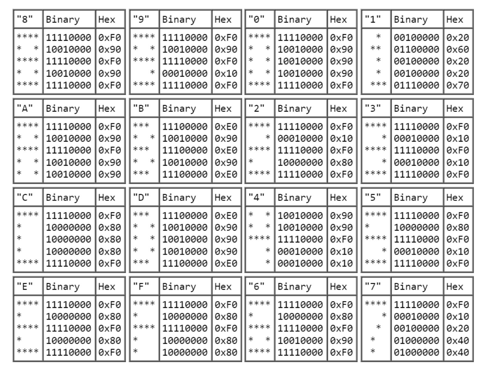

# Chip-8 Virtual Machine / Interpreter

Implementation of the CHIP-8 interpreter / virtual machine from the 1970s, that started as a weekend project; below is an overview of its features and specifications.

# Demo

Some ROMs I downloaded from the internet.

#### Airplane

#### Bad Kaijuju

#### Flight Runner

#### RPS (Rock/Paper/Scissors)

## VM Description

### Memory

The CHIP-8 VM has 4096 memory addresses, each containing 8 bits, totaling 4KB of space. The first 512 bytes were traditionally reserved for the interpreter, but in modern implementations, this space is used for font data. The last 256 bytes are reserved for display refresh, and the preceding 96 bytes are allocated for the call stack, internal use, and other variables.

### Registers

The CHIP-8 has 16 registers (V0...VF). VF is typically used as a flag for carry operations. Additionally, an address register (I) stores a 12-bit wide address.

### Font

The CHIP-8 virtual machine includes a built-in font with characters 0 through F. Here are the character sprite specifications:

|  |
|:--:| 
| *[Source](https://www.cs.columbia.edu/~sedwards/classes/2016/4840-spring/designs/Chip8.pdf)* |

### Display

The display is 64x32 pixels tall, although in this implementation, it's scaled to 640x360. Graphics are handled using the SDL wrapper for Python: Pygame.

### Stack

The stack is used to store return addresses when subroutines are called. Modern implementations do not have the 12-level nesting limitation of older versions. In this implementation I'm using an array outside of the vm's memory.

### Opcode table

| Opcode | Description |
| :--- | :--- |
| 00E0 | Clear the screen |
| 1NNN | Jump to address NNN |
| 6XNN | Set VX to NN |
| 7XNN | Add NN to VX |
| ANNN | Set I to NNN |
| DXYN | Display the value in memory location I at VX, VY position |
| 0NNN | Pause execution and execute the instruction at NNN |
| 2NNN | Push current PC to stack and call subroutine at NNN |
| 00EE | Return from subroutine (pop last address from stack) |
| 3XNN | Conditional skip if VX equals NN |
| 4XNN | Conditional skip if VX does not equal NN |
| 5XY0 | Conditional skip if VX equals VY |
| 9XY0 | Conditional skip if VX does not equal VY |
| 8XY0 | Set VX to the value of VY |
| 8XY1 | Set VX to VX OR VY |
| 8XY2 | Set VX to VX AND VY |
| 8XY3 | Set VX to VX XOR VY |
| 8XY4 | Add VY to VX; VF is set to 1 on carry, 0 otherwise |
| 8XY5 | Subtract VY from VX; VF is set to 0 on borrow, 1 otherwise |
| 8XY6 | Shift VX right by 1; VF is set to the least significant bit of VX before the shift |
| 8XY7 | Set VX to VY - VX; VF is set to 0 on borrow, 1 otherwise |
| 8XYE | Shift VX left by 1; VF is set to the most significant bit of VX before the shift |
| BXNN | Jump to address NNN plus V0 |
| CXNN | Set VX to a random number AND NN |
| EX9E | Skip next instruction if key stored in VX is pressed |
| EXA1 | Skip next instruction if key stored in VX is not pressed |
| FX07 | Set VX to value of delay timer |
| FX15 | Set delay timer to VX |
| FX18 | Set sound timer to VX |
| FX55 | Store V0 to VX in memory starting at address I |
| FX65 | Load V0 to VX from memory starting at address I |
| FX33 | Store binary-coded decimal representation of VX at address I, I+1, and I+2 |
| FX1E | Add VX to I; VF is set to 1 on overflow, 0 otherwise |
| FX0A | Wait for keypress, store key in VX |
| FX29 | Set I to the address of the sprite for the character in VX |

