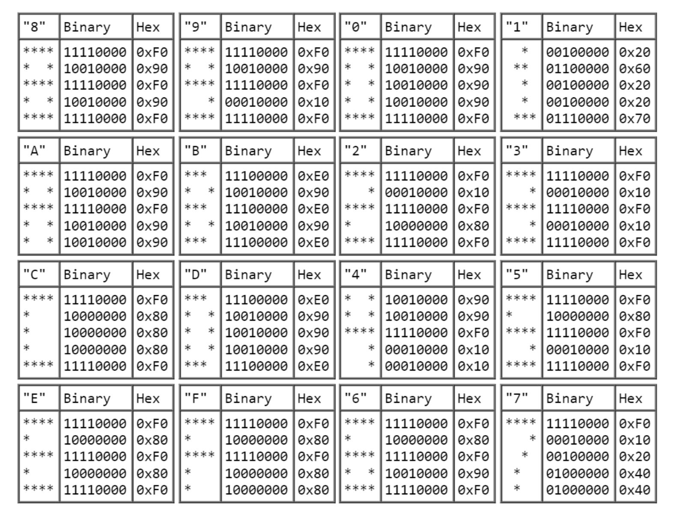

# Chip-8 Virtual Machine

This is my implementation of the CHIP-8 virtual machine from the 1970s.

## VM Description

### Memory

The CHIP-8 vm has 4096 addresses, each containing 8 bit, it has 4KB of space in total. The first 512 bytes were reserve for the interpreter, this is no longer necessary sine the interpreter can run natively in the hose. Modern implementations (like this one) store font data in that reserved spaced. The last 256 bytes are reserved for display refresh, and the previous 96 bytes are reserved for the call stack, internal use, and other variables.

### Registers

The CHIP-8 has 16 registers (V0...VF). VF is typically used for addition, and no borrow flags. Additionally there is an address register (I), which stores a 12 bit wide address (4096 addresses in total). 

### Font

The CHIP-8 emulator has a built-in font. It has the characters 0 trough F. Here's the character sprite specs:

### Display

TODO

### Stack

The stack is used to store return addresses when subroutines are called. In the old days the stack allowd 12 levels of nesting, in modern implementations this is not the case.

### Timers

1. Delay timer
2. Sound timer

### Fetch/decode/execute

TODO

### Opcode table

| Opcode        | Instruction                                              |
| ------------  | -------------------------------------------------------- |
| 00E0          | Clear screen                                             |
| 1NNN          | Jump                                                     |               
| 6XNN          | Set VX to NN                                             |
| 7XNN          | Add NN to VX                                             |
| ANNN          | Set I to NNN                                             |
| DXYN          | Display the value in memory location I at VX VY position |
| 0NNN          | Pause execution and execute instruction in NNN           |
| 2NNN          | Push PC to the stack and call subroutine at NNN          |
| 00EE          | Return from subroutine (pop last address from stack)     | 
| 3XNN          | Conditional skip                                         |
| 4XNN          | Conditional skip                                         |
| 5XY0          | Conditional skip                                         |
| 9XY0          | Conditional skip                                         |
| 6XNN          | Set VX to NN                                             |
| 7XNN          | Add NN to VX                                             |
| 8XY0          | Set VX to the value of VY                                |
| 8XY1          | Set VX to the result of VX || VY                         |
| 8XY2          | Set VX to the result of VX && VY                         |
| 8XY3          | Set VX to the result of VX ^  VY                         |       
| 8XY4          | Set VX to the result of VX + VY (Add)                    | 
| 8XY5/8XY7     | Set VX to the result of VX - VY (Subtract)               |
| 8XY6/8XYE     | Shift the value of VX one bit to the right or left       |
| BXNN          | Jump to address XNN plus the value in VX                 |
| CXNN          | Generates a random number and binary ANDs it with NN     |
| EX9E/EXA1     | Skip the next instruction if a key is being pressed      |
| FX07/FX15/FX18| Timers                                                   |
| FX55/FF66     | Store/Load registers to/from memory                      |
| FX33          | Converts the value in VX to three decimal digits and stores them in the address in I |
| FX1E          | Add the value of VX to I                                 |
| FX0A          | Wait for keypress                                        |
| FX29          | Set I to the address of the hex value in VX              |

